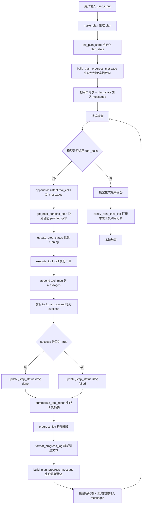

# Agent 执行流程图

```mermaid
flowchart TD
    A[用户输入 user_input] --> B[make_plan 生成 plan]
    B --> C[init_plan_state 初始化 plan_state]
    C --> D[build_plan_progress_message 生成计划状态提示词]
    D --> E[把用户需求 + plan_state 加入 messages]
    E --> F[请求模型]

    F --> G{模型是否返回 tool_calls}

    G -->|是| H[append assistant tool_calls 到 messages]
    H --> I[get_next_pending_step 找到当前 pending 步骤]
    I --> J[update_step_status 标记 running]
    J --> K[execute_tool_call 执行工具]
    K --> L[append tool_msg 到 messages]
    L --> M[解析 tool_msg content 得到 success]
    M --> N{success 是否为 True}

    N -->|是| O[update_step_status 标记 done]
    N -->|否| P[update_step_status 标记 failed]

    O --> Q[summarize_tool_result 生成工具摘要]
    P --> Q
    Q --> R[progress_log 追加摘要]
    R --> S[format_progress_log 转成进度文本]
    S --> T[build_plan_progress_message 生成最新状态]
    T --> U[把最新状态 + 工具摘要加入 messages]
    U --> F

    G -->|否| V[模型生成最终回答]
    V --> W[pretty_print_task_log 打印本轮工具调用记录]
    W --> X[本轮结束]
```