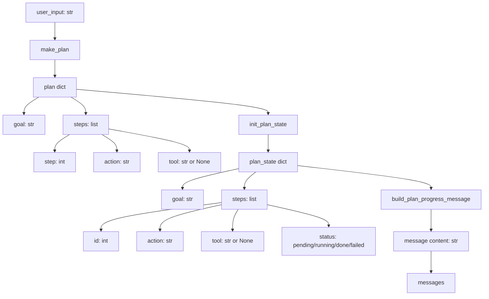

# 核心数据结构流转图


```mermaid
flowchart TD
    A[user_input: str] --> B[make_plan]
    B --> C[plan dict]

    C --> C1[goal: str]
    C --> C2[steps: list]
    C2 --> C3[step: int]
    C2 --> C4[action: str]
    C2 --> C5[tool: str or None]

    C --> D[init_plan_state]
    D --> E[plan_state dict]

    E --> E1[goal: str]
    E --> E2[steps: list]
    E2 --> E3[id: int]
    E2 --> E4[action: str]
    E2 --> E5[tool: str or None]
    E2 --> E6[status: pending/running/done/failed]

    E --> F[build_plan_progress_message]
    F --> G[message content: str]
    G --> H[messages]
```
```